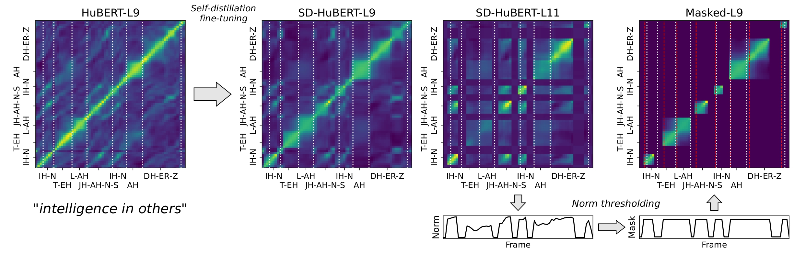

# SD-HuBERT: Sentence-Level Self-Distillation Induces Syllabic Organization In HuBERT

This is the official code base for [SD-HuBERT: Sentence-Level Self-Distillation Induces Syllabic Organization In HuBERT](https://arxiv.org/abs/2310.10803).



## Updates

### 07172025
1. Add a script that can process from an input directory and save to a designated output directory. Check the instruction in the [Extract segments session](###Extract-segments).

### 07112025
1. Fixed some bugs.
2. Added a heuristic silence filter that filters out segments with average wave amplitutes lower than 0.05. (wave form is z-scored.)
3. The input wave forms are chunked by 5 seconds with 500ms overlapping, before being fed into SD-HuBERT. The outputs are overlapped-and-added to have a full-length feature. The reason for this is a) for a faster inference and b) the model is trained with 5 second samples.
4. The script offers a batched inference. (still, the Mincut part is applied one by one.)


## Environment

1. We recommend to set up a conda environment. We trained/tested the model on Python 3.9.
```
conda create -n sdhubert python=3.9
conda activate sdhubert
```
2. Please install a working version of PyTorch which fits your computing resources (tested on torch=1.13.1, CUDA==11.7, Linux).
3. Then install dependency packages through `pip install -r requirements.txt`.
4. We use the segmentation algorithm suggested by [Peng et al., 2023](https://arxiv.org/abs/2305.11435). We are using the implementation shared by the author, so please check the original code/installation [here](https://github.com/jasonppy/syllable-discovery/tree/master). You need Cython for this.
```
cd ./mincut
python setup.py build_ext --inplace
```

## Apply SD-HuBERT to get syllabic tokens

Download [the pretrained model](https://drive.google.com/file/d/1u2jTdAck8qD6ZEb5bqHfvUNsN-9DgGfg/view?usp=drive_link) and put under the `ckpts/`. The following code will provide segment boundaries and the pooled feature per segment.

```python
from model.segmenter import SDHuBERTSegmenter, MincutWrapper

device = "cuda:0"
ckpt_path = "ckpts/sdhubert_base.pt" # or your own path
segmenter = SDHuBERTSegmenter(ckpt_path, layer=9, normcut_strategy="relative",
                              normcut_threshold=0.1, silence_threshold=0.02,
                              device=device)

## syl_dur: asymptotic length of syllable in second. so the below syl_dur=0.1 means it woul have inital 100ms-long syllables.
## merge_threshold: when the similarity of the features of adjacent syllables are above this threshold, they are merged.
mincut = MincutWrapper(syl_dur=0.1, merge_threshold=0.4, ft_sr=50) 

wav_file = "samples/sample.flac"
outputs = mincut(segmenter(wav_file))
```

The output has following format.
```
{'segments': array of boundaries,
 'features': original feature of frames,
 'segment_features': average feature per segment,
 'length': length of frames (in 50hz),
 }
```
The pipeline can handle multiple audio files at once. For that use case, input a list of wave files as `wav_file` and then the outputs should be also the list of individual outputs.

Please check an example jupyter notebook. `exmample.ipynb` 


To get unit category, you can apply pretrained clustering model as follows. Please download the assets ([km](https://drive.google.com/file/d/14zdEttya2X8PdjDMUt4lyHWOOY2OS3Zr/view?usp=drive_link) and [reducer](https://drive.google.com/file/d/19XisepDAfULOKFY147RDYT5UAk2ZnCr-/view?usp=drive_link)) and place under `km/`.

```python
import numpy as np
import joblib

km_path = "km/sdhubert_base_16384.pt"
reducer_path = "km/sdhubert_base_16384to4096.npy"
km_model = joblib.load(km_path)
reducer = np.load(reducer_path)

# Unit prediction
units = [reducer[km_model.predict(segment_feature)] for segment_feature in outputs['segment_features']]
```

### Extract segments

To extract segments from audio files, please run the following command with your own input and output directory.

```
python segment.py --input_dir=INPUT_DIR --output_dir=OUTPUT_DIR
```

The audio files in a specified directory `INPUT_DIR` will be processed. Currently, the script only works on one of `wav`, `flac`, and `ogg` formats.
The results will be saved in `OUTPUT_DIR` with following format for each `AUDIO_FILE_NAME.wav`.

```
AUDIO_FILE_NAME_segments.txt # A comma separated start end end of each syllable segment in second.
AUDIO_FILE_NAME_feature.npy  # A feature per 20ms frame before segmented, having (Length of audio frames, 768) size.
AUDIO_FILE_NAME_segmentfeature.npy # Segment-averaged featue after segmentation, having (Number of segments, 768) size.
```

Please check some other configurations (e.g., path to a model checkpoint) by the following command.
```
python segment.py --help
```


## Training SD-HuBERT

First, download the [LibriSpeech](https://www.openslr.org/12) data under some data directory, let's say `LIBRISPEECH_ROOT`. The directory should look like 
```
LIBRISPEECH_ROOT
├── train-clean-100
├── train-clean-360
├── train-other-500
├── dev-clean
├── dev-other
├── test-clean
└── test-other
```

The trainer is implemented using [PyTorch Lightning](https://lightning.ai/docs/pytorch/stable/), so please download the package through `pip install lightning` (we used lightning==2.1.2).

You can train with the following command. Also please check `configs/sdhubert_base` for detailed configurations.
```
python train.py --config-name=sdhubert_base data.root_dir=LIBRISPEECH_ROOT
```

After the model training is finished, export model to more handy checkpoint file. The `ckpt_path` should be pointed to the path that is created by running the training script.
```
python export_model.py --ckpt_path=outputs/DATE/TIME/NAME
```

## Evaluation

Please run through the following commands to extract segments and evaluate syllable boundary detection, purity, and SSABX task. Also, please check the arguments in the scripts to get full control of experiment.

### Extract segments for LibriSpeech

```
python extract_librispeech_segments.py --ckpt_path={CKPT: e.g., ckpts/sdhubert_base.pt} --librispeech_dataroot=LIBRISPEECH_ROOT
```
This will extract segments under `SEGMENT_PATH=LIBRISPEECH_ROOT/segments/NAME`. The `NAME` is `sdhubert_base` by default.


### Evaluate syllable boundary detection

```
python evaluate_boundary.py --segment_path=SEGMENT_PATH
```

### Train clustering model

```
python train_km.py --segment_path=SEGMENT_PATH --n_clusters=16384 --n_clusters_agglomerative=4096
```

### Evaluate syllable clustering quality

```
python evaluate_purity.py --segment_path=SEGMENT_PATH --km_path=km/sdhubert_base_16384.pt --reducer_path=km/sdhubert_base_16384to4096.npy
```

### Evaluate Spoken Sentence ABX (SSABX) task

Also, check `files/ssabx.json` for the SSABX triplets mined from LibriSpeech (more detail can be found in the paper).
```
python evaluate_ssabx.py --ckpt_path={CKPT: e.g., ckpts/sdhubert_base.pt} --librispeech_dataroot=LIBRISPEECH_ROOT
```

## Acknowledgements

Thanks to Puyuan Peng for sharing the [code and resources](https://github.com/jasonppy/syllable-discovery/tree/master). 

## Citation

```
@inproceedings{cho2023sd,
  title={SD-HuBERT: Sentence-Level Self-Distillation Induces Syllabic Organization in HuBERT},
  author={Cho, Cheol Jun and Mohamed, Abdelrahman and Li, Shang-Wen and Black, Alan W and Anumanchipalli, Gopala K},
  journal={ICASSP},
  year={2024}
}
```
